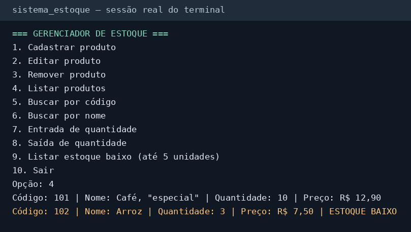

# Gerenciador de estoque em C

Estoque de terminal em C11, com cadastro, buscas, edição e movimentação.<br>
Preços em centavos, salvamento seguro em CSV e alertas de estoque baixo.<br>
Sem bibliotecas externas, com testes automatizados e sanitizers.



[Ver a transcrição completa da demonstração](docs/demonstracao.txt).

## Começar a usar

Requisitos: GCC com suporte a C11, Make e terminal UTF-8. O CI usa Linux.

```sh
make
make run
```

O programa salva `estoque.csv` no diretório de execução. Se o arquivo não existir, começa com um estoque vazio. Cada alteração é confirmada somente após salvar; uma falha cancela a alteração também em memória.

## Menu

| Opção | Ação |
| --- | --- |
| 1 | Cadastrar produto |
| 2 | Editar produto |
| 3 | Remover produto |
| 4 | Listar produtos |
| 5 | Buscar por código |
| 6 | Buscar por nome ou parte do nome |
| 7 | Registrar entrada de quantidade |
| 8 | Registrar saída de quantidade |
| 9 | Listar estoque baixo, até 5 unidades |
| 10 | Sair |

No cadastro, digite um código único, nome, quantidade e preço. Um código repetido é informado imediatamente, antes dos outros campos. Na edição, o código pode ser mantido ou trocado por outro ainda não cadastrado.

```text
Código: 101
Nome: Café, "especial"
Quantidade: 10
Preço (R$): 12,90
Alteração salva com sucesso.
```

O preço aceita ponto ou vírgula e até duas casas decimais; a tela sempre exibe vírgula. Valores negativos, `nan`, `inf`, notação científica e casas excedentes são rejeitados. Uma saída acima do saldo disponível é bloqueada. A busca por nome diferencia maiúsculas, minúsculas e acentos.

A opção 10 ou EOF (Ctrl+D no Linux) encerra. Um formulário interrompido não é salvo. Os alertas de estoque baixo aparecem na abertura, nas listagens e após alterações.

## Testes e compilação

```sh
make test
make debug
```

Os três conjuntos em `tests/` usam C11 e `assert`, sem frameworks: regras e CSV; interação do menu; falhas simuladas de `malloc` e `realloc`. Os arquivos temporários dos testes ficam em `build/` e são removidos ao concluir.

A cobertura inclui todas as operações, duplicidade imediata no cadastro e na edição, preços com vírgula na tela e ponto no CSV, vetor com mais de 100 produtos, estouros numéricos, saldo insuficiente, arquivos ausentes ou corrompidos, UTF-8, caracteres invisíveis, entradas extensas, EOF, avisos sobre temporários e preservação dos dados quando a gravação ou a alocação falha.

`make debug` compila e executa os mesmos testes com AddressSanitizer, UndefinedBehaviorSanitizer e LeakSanitizer. Para usar o menu instrumentado:

```sh
./build/debug/sistema_estoque
```

Execute LeakSanitizer fora de depuradores que usam `ptrace`. O GitHub Actions compila com `-Wall -Wextra -Wpedantic -Werror` e executa os testes normais e instrumentados a cada push e pull request.

Para compilar sem Make:

```sh
gcc -std=c11 -Wall -Wextra -Wpedantic src/main.c src/produto.c src/armazenamento.c -o sistema_estoque
./sistema_estoque
```

`make all` gera o binário. `make clean` remove binários e `build/`, preservando o CSV usado pelo programa.

## Organização

| Caminho | Responsabilidade |
| --- | --- |
| `src/main.c` | Menu e interação |
| `src/produto.h`, `src/produto.c` | Vetor dinâmico, validações e regras do estoque |
| `src/armazenamento.h`, `src/armazenamento.c` | CSV e gravação segura |
| `tests/` | Testes de regras, interação e memória |
| `docs/` | Captura e transcrição da demonstração |
| `Makefile` | Compilação, execução, testes e limpeza |

## Formato do CSV

UTF-8, sem cabeçalho ou BOM, um produto por linha. Os quatro campos são código, nome, quantidade e preço em reais:

```csv
101,"Café, ""especial""",10,12.90
102,"Arroz",3,7.50
```

O arquivo usa ponto decimal e duas casas; internamente, `12.90` são 1290 centavos. Nomes são gravados entre aspas e suas aspas internas são duplicadas. A leitura aceita o formato antigo com nomes sem aspas, LF ou CRLF e a última linha sem quebra final.

Código deve ser positivo; quantidade e preço podem ser zero. Linhas malformadas ou com códigos repetidos são avisadas individualmente e ignoradas, e a leitura continua até o fim. Se houver linhas inválidas, o menu permite consultar os produtos válidos e bloqueia alterações para preservar o original. Faça uma cópia, corrija as linhas indicadas e reinicie. Erros de leitura ou de alocação interrompem a abertura sem sobrescrever o arquivo.

A gravação cria `estoque.csv.tmp` de forma exclusiva no mesmo diretório. Só após escrita, `fflush` e `fclose` bem-sucedidos o temporário é renomeado para `estoque.csv`. Um temporário existente nunca é truncado: o programa avisa na abertura e as novas gravações falham enquanto ele existir. Com todas as instâncias encerradas, confira o conteúdo e mova ou remova o temporário antes de tentar novamente.

## Limitações conhecidas

- Nomes têm até 127 bytes UTF-8. Controles, quebras de linha, controles de direção, espaço de largura zero, hifenização invisível, junções invisíveis de palavras e BOM são rejeitados. Nomes compostos apenas por espaços ou caracteres de formatação ignoráveis também são inválidos. Junções usadas na escrita e seletores de variação de emojis são preservados quando acompanham conteúdo visível. As faixas verificadas seguem o [Unicode 17.0](https://www.unicode.org/Public/17.0.0/ucd/PropList.txt) e suas [propriedades derivadas](https://www.unicode.org/Public/17.0.0/ucd/DerivedCoreProperties.txt); não há normalização Unicode ou validação visual dependente da fonte. Arquivos antigos com caracteres agora rejeitados precisam de correção manual.
- O alerta de estoque baixo usa o limite global de 5 unidades. Não há mínimo individual por produto.
- Código e quantidade são limitados por `INT_MAX` (normalmente 2147483647). O preço máximo é R$ 92233720368547758,07 (`INT64_MAX` centavos). A quantidade de produtos depende da memória disponível; buscas são lineares e cada alteração usa uma cópia temporária do estoque.
- Use uma instância por CSV. Não há bloqueio contra execuções simultâneas ou alterações externas. CSV corrompido e temporários deixados por interrupções exigem intervenção manual.
- A substituição por `rename` é atômica em POSIX, como Linux. C11 não fornece `fsync`, portanto não há garantia de durabilidade em falta de energia. Em sistemas que não permitem substituir arquivos existentes por `rename`, a gravação falha e preserva o arquivo anterior.

## Licença

Este projeto está sob a licença MIT. Consulte o arquivo [LICENSE](LICENSE).
